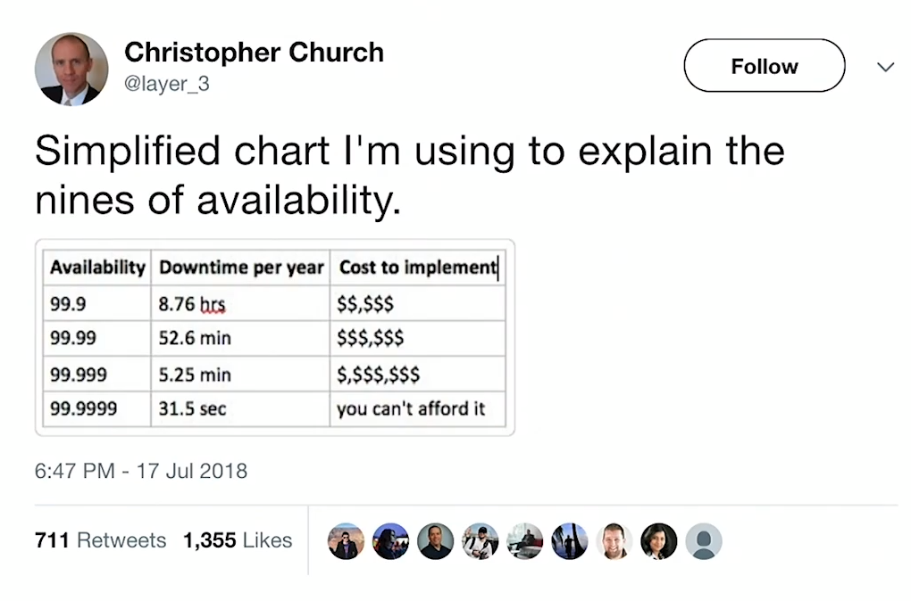

# Observability at Google

Based on the Jaana Burcu Dogan (Instrumentation Team @ Google) presentation of the Google Case Studies. It's worth saying that most of the ideas in this section are opinions adopted by Google, not exactly some academical or industry-wise consensus.

## History
Google is a huge company with a lot of approaches and solutions to many problems regarding Observability. For a long time now, Google has been a company with many distributed systems and teams. The service count is around the 10ks while over 100s of teams. Many backends and analysis tools were invented in-house (which Google has a long history of doing).

## The challenge of availability

Although availability is something very hard to simplify, we usually use the *Nine's Notation* to measure how much of the time a service will be available to the end user. The previous figure shows an estimate cost of adding more nines to the availability of an hypothetical system.

Unfortunately (or not), a 100% of availability is a lie! It's way too complex and too much expensive to do it, specially in the distributed world. So this begs the question of what is good enough availability or a more modern definition of availability?

_A service is available if users cannot tell there's an outage._

So if something is out but you as an user cannot tell it's out, the service still is available. This can lead to some poor user experience like a huge latency and a slow service, but the service still is considered available. It's important to clarify that a service doesn't necessarily means a process, but a component as a whole.

Failures are going to happen, but it should be rare enough that users wouldn't be that bothered about it. The important message here is: _availability really depends on the use case and and how much the users can tolerate_ and more than that: _good enough availability is something other than 100% availability_.

## How we define availability
The principled way of saying what level of downtime is acceptable is the SLO (Service Level Object), which has two main categories of:

- Error rate
- Latency expectations

How much of these are acceptable? With these two metrics established, we're able to design our systems to meet these expectations. This stuff is very useful to set alerts and let the development team know that something is wrong.

## Observability is more than just availability
As soon as we face an outage and something needs to be done to restore the peace in the universe, it gets clear that an observable systems tells you more than its availability!

The team response to a problem should be quite fast, and we're expected to find the problem and implement a solution so the users can use the system again. The metrics don't help the debugging and don't show the full picture of a system. An observable system gives you visibility in things like availability, but it doesn't stop there, showing you things like:

- Context and the scope of the problem
- Status of the system, its components and interactions of these components
- A measurement of the expectations regarding the system and how the current metrics don't align to these
- Data to debug

Without these you can't quite analyse a problem and act on an outage. The question is how we do that? The team should:

- Observe by collecting signals
- Export them to analysis tools
- Correlate and analyse to find the root cause

Without data we don't have visibility. Sometimes we need to look at logs, sometimes we need metrics, sometimes we need to take a look at profiles or traces. The thing is, these signals are not standalone or isolated, the consumers of these data must look at all of these variables as a whole, we need to correlate.

### This is very hard, enter Census
The process of making sense of the huge data stream and correlate is a very challenging problems. Not only for the analysis itself, the technical solution for such a problem is also very challenging. You have requirements like:

- integration for web, RPC and storage clients
- support a multitude of languages
- be context aware (eg. sandbox, canary vs prod)
- support various analysis tools
- allow developers to add custom instrumentation (for instance, allow custom traces)

This is too hard, and the reason why Google implemented the internal framework known as Census

## OpenCensus
Census is a single distribution of libraries that automatically collect traces and metrics from your app, display them locally, and send them to any backend. Census was one of those missing parts that is very critical for Google's library stack, specifically the RPC stack. And by open sourcing it, it's going to fill the gap in instrumentation correlational libraries.

(OpenCensus)[https://github.com/census-instrumentation] instrument your code so everything will look end to end and in a very compatible way, then you can just export the data to whatever analysis tool, backend, vendor, whatever you like, or whatever you already use.

The very silent launch gave Google the opportunity to collaborate with a lot of tool and framework makers and also big companies and cloud providers. It's far from being a Google project at this point
