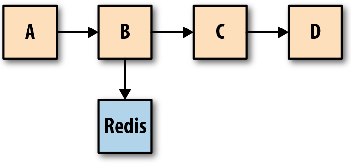

# Chapter 1. The Need for Observability 

## What Is Observability?
Observability might mean different things to different people. For some, it’s about logs, metrics, and traces. For others, it’s the old wine of monitoring in a new bottle. The overarching goal of various schools of thought on observability, however, remains the same—bringing better visibility into systems.

## THE MANY FACES OF OBSERVABILITY
The focus of this report is on logs, metrics, and traces. However, these aren’t the only observability signals. Exception trackers like the open source Sentry can be invaluable, since they furnish information about thread-local variables and execution stack traces in addition to grouping and de-duplicating similar errors or exceptions in the UI.

Detailed profiles (such as CPU profiles or mutex contention profiles) of a process are sometimes required for debugging. This report does not cover techniques such as SystemTap or DTrace, which are of great utility for debugging standalone programs on a single machine, since such techniques often fall short while debugging distributed systems as a whole.

Also outside the scope of this report are formal laws of performance modeling such as universal scalability law, Amdahl’s law, or concepts from queuing theory such as Little’s law. Kernel-level instrumentation techniques, compiler inserted instrumentation points in binaries, and so forth are also outside the scope of this report.

# Chapter 2. Monitoring and Observability

No discussion on observability is complete without contrasting it to monitoring. Observability isn’t a substitute for monitoring, nor does it obviate the need for monitoring; they are complementary. The goals of monitoring and observability, as shown in Figure 2-1, are different.

Observability is a superset of monitoring. It provides not only high-level overviews of the system’s health but also highly granular insights into the implicit failure modes of the system. 

Monitoring, on the other hand, is best suited to report the overall health of systems and to derive alerts.

## Alerting Based on Monitoring Data

Systems becoming more distributed has led to the advent of sophisticated tooling and platforms that abstract away several of the problems that human- and failure-centric monitoring of yore helped uncover. Health-checking, load balancing, and taking failed services out of rotation are features that platforms like Kubernetes provide out of the box, freeing operators from needing to be alerted on such failures.

### BLACKBOX AND WHITEBOX MONITORING

Traditionally, much of alerting was derived from blackbox monitoring. Blackbox monitoring refers to observing a system from the outside—think Nagios-style checks. This type of monitoring is useful in being able to identify the symptoms of a problem (e.g., “error rate is up” or “DNS is not resolving”), but not the triggers across various components of a distributed system that led to the symptoms.

Whitebox monitoring refers to techniques of reporting data from inside a system. For systems internal to an organization, alerts derived from blackbox monitoring techniques are slowly but surely falling out of favor, as the data reported by systems can result in far more meaningful and actionable alerts compared to alerts derived from external pings. However, blackbox monitoring still has its place, as some parts (or even all) of infrastructure are increasingly being outsourced to third-party software that can be monitored only from the outside.

However, there’s a paradox: even as infrastructure management has become more automated and requires less human elbow grease, understanding the lifecycle of applications is becoming harder.

## Best Practices for Alerting

Alerting should still be both hard failure–centric and human-centric. The goal of using monitoring data for alerting hasn’t changed, even if the scope of alerting has shrunk.

Monitoring data should at all times provide a bird’s-eye view of the overall health of a distributed system by recording and exposing high-level metrics over time across all components of the system (load balancers, caches, queues, databases, and stateless services). Monitoring data accompanying an alert should provide the ability to drill down into components and units of a system as a first port of call in any incident response to diagnose the scope and coarse nature of any fault.

Additionally, in the event of a failure, monitoring data should immediately be able to provide visibility into the impact of the failure as well as the effect of any fix deployed.

### What Monitoring Signals to Use for Alerting?

A good set of metrics used for monitoring purposes are the USE metrics and the RED metrics. In the book Site Reliability Engineering (O’Reilly), Rob Ewaschuk proposed the four golden signals (latency, errors, traffic, and saturation) as the minimum viable signals to monitor for alerting purposes.

The USE methodology for analyzing system performance was coined by Brendan Gregg. The USE method calls for measuring utilization, saturation, and errors of primarily system resources, such as available free memory (utilization), CPU run queue length (saturation), or device errors (errors).

The RED method was proposed by Tom Wilkie, who claims it was “100% based on what I learned as a Google SRE.” The RED method calls for monitoring the request rate, error rate, and duration of request (generally represented via a histogram), and is necessary for monitoring request-driven, application-level metrics.

### Observability Isn’t a Panacea

The most effective debugging tool is still careful thought, coupled with judiciously placed print statements.

More importantly, the dire need for higher-level abstractions (such as good visualization tooling) to make sense of the mountain of disparate data points from various sources cannot be overstated.

# Chapter 3. Coding and Testing for Observability

Historically, testing has been something that referred to a pre-production or pre-release activity. Some companies employed—and continue to employ—dedicated teams of testers or QA engineers to perform manual or automated tests for the software built by development teams. Once a piece of software passed QA, it was handed over to the operations team to run (in the case of services) or shipped as a product release (in the case of desktop software or games).

This model is slowly but surely being phased out (at least as far as services go). Development teams are now responsible for testing as well as operating the services they author. This new model is incredibly powerful. It truly allows development teams to think about the scope, goal, trade-offs, and payoffs of the entire spectrum of testing in a manner that’s realistic as well as sustainable.

## Coding for Failure

Coding for failure entails acknowledging that systems will fail, being able to debug such failures is of paramount importance, and enshrining debuggability into the system from the ground up.

### Operational Characteristics of the Dependencies

We build on top of increasingly leaky abstractions with failure modes that are not well understood. Here are some examples of such characteristics I’ve had to be conversant with in the last several years:

* The default read consistency mode of the Consul client library (the default is usually “strongly consistent,” which isn’t something you necessarily want for service discovery)
* The caching guarantees offered by an RPC client or the default TTLs
* The threading model of the official Confluent Python Kafka client and the ramifications of using it in a single-threaded Python server
* The default connection pool size setting for pgbouncer, how connections are reused (the default is LIFO), and whether that default is the best option for the given Postgres installation topology

Understanding such dependencies better has sometimes meant changing only a single line of configuration somewhere or overriding the default provided by a library, but the reliability gains from changes have been immense.

## Testing for Failure

"The first moral of the story is that program testing can be used very effectively to show the presence of bugs but never to show their absence."

Unit tests only ever test the behavior of a system against a specified set of inputs. Furthermore, tests are conducted in very controlled (often heavily mocked) environments. While the few who do fuzz their code benefit from having their code tested against a set of randomly generated input, fuzzing can comprehensively test against the set of inputs to only one service. End-to-end testing might allow for some degree of holistic testing of the system, but complex systems fail in complex ways, and there is no testing under the sun that enables one to predict every last vector that could contribute toward a failure.

This isn’t to suggest that testing is useless. If nothing else, testing enables one to write better, maintainable code. More importantly, research has shown that something as simple as “testing error handling code could have prevented 58% of catastrophic failures” in many distributed systems. The renaissance of tooling aimed to understand the behavior of our services in production does not obviate the need for pre-production testing.

# Chapter 4. The Three Pillars of Observability

Logs, metrics, and traces are often known as the three pillars of observability. While plainly having access to logs, metrics, and traces doesn’t necessarily make systems more observable, these are powerful tools that, if understood well, can unlock the ability to build better systems.

## Event Logs

An event log is an immutable, timestamped record of discrete events that happened over time. Event logs in general come in three forms but are fundamentally the same: a timestamp and a payload of some context. The three forms are:

* Plaintext: A log record might be free-form text. This is also the most common format of logs.

* Structured: Much evangelized and advocated for in recent days. Typically, these logs are emitted in the JSON format.

* Binary: Think logs in the Protobuf format, MySQL binlogs used for replication and point-in-time recovery, systemd journal logs, the pflog format used by the BSD firewall pf that often serves as a frontend to tcpdump.

As such, event logs are especially helpful for uncovering emergent and unpredictable behaviors exhibited by components of a distributed system.

Traces and metrics are an abstraction built on top of logs that pre-process and encode information along two orthogonal axes, one being request-centric (trace), the other being system-centric (metric).

An alternative is Humio, a hosted and on-premises solution that treats log processing as a stream processing problem. Log data can be streamed from each machine directly into Humio without any pre-aggregation. Humio uses sophisticated compression algorithms to effectively compress and retrieve the log data. Instead of a priori indexing, Humio allows for real-time, complex queries on event stream data. Since Humio supports text-based logs (the format that the vast majority of developers are used to grepping), ad hoc schema on reads allows users to iteratively and interactively query log data. Yet another alternative is Honeycomb, a hosted solution based on Facebook’s Scuba that takes an opinionated view of accepting only structured events, but allows for read-time aggregation and blazing fast real-time queries over millions of events.

## Metrics

Metrics are a numeric representation of data measured over intervals of time. Metrics can harness the power of mathematical modeling and prediction to derive knowledge of the behavior of a system over intervals of time in the present and future.

Since numbers are optimized for storage, processing, compression, and retrieval, metrics enable longer retention of data as well as easier querying. This makes metrics perfectly suited to building dashboards that reflect historical trends. Metrics also allow for gradual reduction of data resolution. After a certain period of time, data can be aggregated into daily or weekly frequency.

### The Anatomy of a Modern Metric

A metric in Prometheus, as shown in Figure 4-1, is identified using both the metric name and the labels. The actual data stored in the time series is called a sample, and it consists of two components: a float64 value and a millisecond precision timestamp.

### Advantages of Metrics over Event Logs

By and large, the biggest advantage of metrics-based monitoring over logs is that unlike log generation and storage, metrics transfer and storage has a constant overhead. Unlike logs, the cost of metrics doesn’t increase in lockstep with user traffic or any other system activity that could result in a sharp uptick in data.

### The Drawbacks of Metrics

The biggest drawback with both application logs and application metrics is that they are system scoped, making it hard to understand anything else other than what’s happening inside a particular system. Sure, metrics can also be request scoped, but that entails a concomitant increase in label fan-out, which results in an increase in metric storage.

Using high cardinality values like UIDs as metric labels can overwhelm time-series databases.

## Tracing

A trace is a representation of a series of causally related distributed events that encode the end-to-end request flow through a distributed system.

Traces are used to identify the amount of work done at each layer while preserving causality by using happens-before semantics. Figure 4-2 shows the flow of a single request through a distributed system. The trace representation of this request flow is shown in Figure 4-3. A trace is a directed acyclic graph (DAG) of spans, where the edges between spans are called references.

When a request begins, it’s assigned a globally unique ID, which is then propagated throughout the request path so that each point of instrumentation is able to insert or enrich metadata before passing the ID around to the next hop in the meandering flow of a request. Each hop along the flow is represented as a span (Figure 4-4). When the execution flow reaches the instrumented point at one of these services, a record is emitted along with metadata. These records are usually asynchronously logged to disk before being submitted out of band to a collector, which then can reconstruct the flow of execution based on different records emitted by different parts of the system.

Zipkin and Jaeger are two of the most popular OpenTracing-compliant open source distributed tracing solutions. (OpenTracing is a vendor-neutral spec and instrumentation libraries for distributed tracing APIs.)

## The Challenges of Tracing

Tracing is, by far, the hardest to retrofit into an existing infrastructure, because for tracing to be truly effective, every component in the path of a request needs to be modified to propagate tracing information. Depending on whom you ask, you’d either be told that having gaps in the flow of a request doesn’t outweigh the cons (since adding tracing piecemeal is seen as better than having no tracing at all, as having partial tracing helps eke out nuggets of knowledge from the fog of war) or be told that these gaps are blind spots that make debugging harder.

All approaches have their own pros and cons, and one might even want to use them all.

### Service Meshes: A New Hope for the Future?

# Chapter 5. Conclusion

As my friend Brian Knox, who manages the Observability team at DigitalOcean, said,

The goal of an Observability team is not to collect logs, metrics, or traces. It is to build a culture of engineering based on facts and feedback, and then spread that culture within the broader organization.

