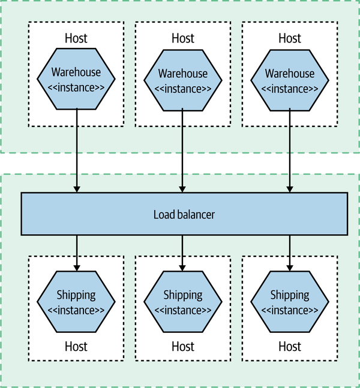

# Chapter 10. From Monitoring to Observability

In this chapter, we’ll look at the challenges associated with monitoring our microservice architecture, and I’ll show that although new tools can help, fundamentally you may need to shift your entire mindset when it comes to working out what the hell is going on in production. We’ll also talk about the increased focus on the concept of observability—understanding how to make it possible to ask questions of our system so we can work out what is going wrong.

> PRODUCTION PAIN
>
> You won’t truly appreciate the potential pain, suffering, and anguish caused by a microservice architecture until you have it running in production and serving real traffic.

Firstly, we need to monitor the small things and provide aggregation to allow us to see the bigger picture. Then, we need to make sure we have tools available to us to slice and dice this data as part of our investigation. Finally, we need to get smarter about how we think about system health, by embracing concepts like testing in production. We’ll discuss each of these necessities in this chapter. Let’s get started.

## Single Microservice, Single Server

Figure 1 presents a very simple setup: one host that is running one instance of a microservice. Now we need to monitor it in order to know when something goes wrong, so we can fix it. So what should we look for?

First, we’ll want to get information from the host itself. CPU, memory—all of these things can be useful. Next, we’ll want to have access to the logs from the microservice instance itself. If a user reports an error, we should be able to see the error in these logs, hopefully giving us a way to work out what went wrong. At this point, with our single host, we can probably get by with just logging locally to the host and using command-line tools to look at the log.

Time passes, loads increase, and we find ourselves needing to scale…

## Single Microservice, Multiple Servers

At this point, we still want to track the host-level metrics, and perhaps maybe even alert on them when they pass some sort of threshold. But now we want to see what they are across all hosts, as well as individual hosts.

Then we have our logs. With our service running on more than one server, we’ll probably get tired of logging into each box to look at it. With just a few hosts, though, we can use tools like SSH multiplexers, which allow us to run the same commands on multiple hosts. With the help of a big monitor, and running grep "Error" on our microservice log, we can find our culprit.

For tasks like response time tracking, we can capture response times at the load balancer for downstream calls to microservices. However, we also have to consider what happens if the load balancer is turning out to be the bottleneck in our system—capturing response times both at the load balancer and at the microservices themselves could be needed

## Multiple Services, Multiple Servers

In Figure 3, things get much more interesting. Multiple services are collaborating to provide capabilities to our users, and those services are running on multiple hosts, be they physical or virtual.

Aggregation of information—metrics and logs—play a vital part in making this happen. But this is not the only thing we need to consider. We need to work out how to sift this huge influx of data and try to make sense of it all. Above all, this is largely about a mindset shift, from a fairly static landscape of monitoring to the more active world of observability and testing in production.

## Observability Versus Monitoring

We can see monitoring as an activity—something we do—with observability being a property of the system.

## The Pillars of Observability? Not So Fast

Some people have attempted to distill down the idea of observability to a few core concepts. Some have focused on “the three pillars” of observability in the form of metrics, logging, and distributed tracing. New Relic even coined the term MELT (metrics, event, logs, and traces), which hasn’t really caught on, but at least New Relic is trying.

> NOTE
> Observability is the extent to which you can understand what the system is doing based on external inputs. Logs, events, and metrics might help you make things observable, but be sure to focus on making the system understandable rather than throwing in lots of tools.

## Building Blocks for Observability

When a problem does occur, we need to work out what we can do to get the system up and running again, and once the dust has settled we want to have enough information in hand to work out what the hell went wrong and what we can do to avoid the problem happening again.

We will be covering a number of building blocks that can help improve the observability of your system architecture:

- Log aggregation

    Collecting information across multiple microservices, a vital building block of any monitoring or observability solution

- Metrics aggregation

    Capturing raw numbers from our microservices and infrastructure to help detect problems, drive capacity planning, and perhaps even scale our applications

- Distributed tracing
    
    Tracking a flow of calls across multiple microservice boundaries to work out what went wrong and derive accurate latency information

- Are you doing OK?
    
    Looking at error budgets, SLAs, SLOs, and so on to see how they can be used as part of making sure our microservice is meeting the needs of its consumers

- Alerting

    What should you alert on? What does a good alert look like?

- Semantic monitoring

    Thinking differently about the health of our systems, and about what should wake us up at 3 a.m.

- Testing in production

    A summary of various testing in production techniques

## Log Aggregation

As we’ll discuss shortly, there are a variety of tools in this space, but they all largely operate in the same way, as outlined in Figure 4. Processes (like our microservice instances) log to their local filesystem. A local daemon process periodically collects and forwards this log to some sort of store that can be queried by operators. One of the nice aspects of these systems is that your microservice architecture can be largely unaware of them. You don’t need to change your code to use some sort of special API; you just log to a local filesystem. You do need to understand the failure modes around this log shipping process, though, especially if you want to understand the situations logs can get lost in.

> BEFORE ANYTHING ELSE
>
> Before you do anything else to build out your microservice architecture, get a log aggregation tool up and running. Consider it a prerequisite for building a microservice architecture. You’ll thank me later.

### Correlating log lines

With a large number of services interacting to provide any given end-user capability, a single initiating call can end up generating multiple downstream service calls. For example, let’s consider an example in MusicCorp, as shown in Figure 5. We are signing up a customer to our new streaming service.

We can’t see this error in the wider context in which it occurs. In this particular example, even if we assume that each interaction generates only a single log line, we’d have five log lines with information about this flow of calls. Being able to see these log lines grouped together can be incredibly useful.

Logging of any activity by a microservice caused by this incoming call will be recorded along with the same correlation ID, which we place in a consistent location in each log line. This makes it easy to extract all logs associated with a given correlation ID at a later date.

> TIP
>
> Once you have log aggregation, get correlation IDs in as soon as possible. Easy to do at the start and hard to retrofit later, they will drastically improve the value of your logs.

### Timing

The problem of clock skew causes all sorts of issues in distributed systems. Protocols do exist to try and reduce clock skew in systems—the Network Time Protocol (NTP) being the most widely used example. NTP, however, isn’t guaranteed to work, and even when it does work, all it can do is reduce skew, not eliminate it. If you have a sequence of calls that happen quite close together, you may find that even a second of skew across machines is enough for your understanding of the sequence of calls to be totally changed.

### Implementations

A popular open source toolchain for log aggregation has been to make use of a log forwarding agent like Fluentd to send logs to Elasticsearch, using Kibana as a way to slice and dice the resulting stream of logs.

In many ways, Kibana was a laudable attempt to create an open source alternative to expensive commercial options like Splunk. As good as Splunk seems to be, every Splunk customer I’ve spoken to has also told me that it can be eye-wateringly expensive, in terms of both the licensing fees and the hardware costs. Many of these customers do see its value, though. That said, there are a wealth of commercial options out there. I’m personally a big fan of Humio, many people like to use Datadog for log aggregation, and you have basic but workable out-of-the-box solutions for log aggregation with some public cloud providers, such as CloudWatch for AWS or Application Insights for Azure.

## Metrics Aggregation

In a more complex environment, we’ll be provisioning new instances of our microservices pretty frequently, so we want the system we pick to make it very easy to collect metrics from new hosts. We’ll want to be able to look at a metric aggregated for the whole system—for example, the average CPU load—but we’ll also want to aggregate that metric for all the instances of a given service, or even for a single instance of that service. That means we’ll need to be able to associate metadata with the metric to allow us to infer this structure.

Another key benefit of understanding your trends is when it comes to capacity planning. Are we reaching our limit? How long until we need more hosts? In the past when we bought physical hosts, this was often an annual job. In the new age of on-demand computing provided by infrastructure as a service (IaaS) vendors, we can scale up or down in minutes, if not seconds. This means that if we understand our usage patterns, we can make sure we have just enough infrastructure to serve our needs. The smarter we are in tracking our trends and knowing what to do with them, the more cost effective and responsive our systems can be.

## Distributed Tracing

As our systems become more complex, it therefore becomes important to have a way of seeing these traces through our systems. We need to be able to pull this disparate data to give us a joined-up view of a set of correlated calls. As we’ve already seen, doing something simple like putting correlation IDs into our logfiles is a good start, but it’s a fairly unsophisticated solution, especially as we’ll end up having to create our own custom tooling to help visualize, slice, and dice this data. This is where distributed tracing comes in

### How it works

Although the exact implementations vary, broadly speaking, distributed tracing tools all work in a similar way. Local activity within a thread is captured in a span. These individual spans are correlated using some unique identifier. The spans are then sent to a central collector, which is able to construct these related spans into a single trace. In Figure 10-7, we see a picture from Honeycomb that shows a trace across a microservice architecture.

### Implementing distributing tracing

Getting distributed tracing up and running for your system requires a few things. Firstly, you need to capture span information inside your microservices. If you are using a standard API like OpenTracing or the newer OpenTelemetry API, you might find that some of the third-party libraries and frameworks will come with support for these APIs built in and will already send useful information (for example, automatically capturing information about HTTP calls). But even if they do, chances are you’ll still want to instrument your own code, providing useful information about what your microservice is doing at any given point of time.

Next, you’ll need some way to send this span information to your collector—it may be that you send this data directly from your microservice instance to the central collector, but it’s much more common to use a local forwarding agent. So as with log aggregation, you run an agent locally to your microservice instance, which will periodically send the span information to a central collector. The use of a local agent typically allows for some more advanced capabilities, such as changing sampling or adding additional tags, and can also more effectively buffer information being sent.

Lastly, of course, you need a collector able to receive this information and make sense of it all.

In the open source space, Jaeger has emerged as a popular choice for distributed tracing. For commercial tooling, I’d start by looking at the already mentioned Lightstep and Honeycomb. I’d urge you, though, to pick something that is committed to supporting the OpenTelemetry API. OpenTelemetry is an open API specification that makes it much easier to have code such as database drivers or web frameworks come out of the box with support for tracing, and it can also give you easier portability across different vendors on the collection side. Based on work done by the earlier OpenTracing and OpenConsensus APIs, this API now has broad industry support.

## Are We Doing OK?

We can try to work out if a service is healthy by deciding, for example, what a good CPU level is, or what makes for an acceptable response time. If our monitoring system detects that the actual values fall outside this safe level, we can trigger an alert. However, in many ways, these values are one step removed from what we actually want to track—namely, is the system working? The more complex the interactions between the services, the further removed we are from actually answering that question by just looking at one metric in isolation.

So we can gather a lot of information, but by itself that doesn’t help us answer the question of whether the system is working properly. For that, we need to start thinking a bit more in terms of defining what acceptable behavior looks like. Much work has been done in the space of site reliability engineering (SRE), the focus of which is how we can ensure that our systems can be reliable while still allowing for change. From this space, we have a few useful concepts to explore.

### Service-level agreement

A service-level agreement (SLA) is an agreement reached between the people building the system and the people using the system. It describes not only what the users can expect but also what happens if the system doesn’t reach this level of acceptable behavior

### Service-level objectives

Mapping an SLA down to a team is problematic, especially if the SLA is somewhat broad and cross-cutting. At a team level, we instead talk about service-level objectives (SLOs). SLOs define what the team signs up to provide. Achieving the SLOs of every team across the organization will satisfy (and likely greatly exceed) the requirements of the organization’s SLAs. Example SLOs could include things like expected uptime or acceptable response times for a given operation.

### Service-level indicators

To determine if we are meeting our SLOs, we need to gather real data. This is what our service-level indicators (SLI) are. An SLI is a measure of something our software does. It could, for example, be a response time from a process, a customer being registered, an error being raised to the customer, or an order being placed. We need to collect and surface these SLIs to make sure we are meeting our SLOs.

### Error budgets

When we try new things, we inject more potential instability into our systems. As such, a desire to maintain (or improve) system stability could result in change being discouraged. Error budgets are an attempt to avoid this problem by being clear about how much error is acceptable in a system.

Error budgets help give you a clear understanding of how well you are achieving (or not) an SLO, allowing you to make better decisions about what risks to take. If you are well under your error budget for the quarter, perhaps you are OK with rolling out that microservice written in a new programming language. If you’ve already exceeded your error budget, maybe you put off that rollout, and instead focus more of the team’s time on improving the reliability of your system.

## Alerting

On occasion (hopefully rarely, but likely more than we’d like), something will happen in our systems that will require a human operator to be notified to take action. A microservice may have unexpectedly become unavailable, we might be seeing a larger number of errors than we’d expect, or perhaps the entire system has become unavailable for our users. In these situations, we need people to be made aware of what’s happening so they can try and fix things.

### Some problems are worse than others

When something goes wrong, we want to know about it. Or do we? Are all problems the same? As the sources of problems increase, it can become more important to be able to prioritize these issues to decide if, and how, a human operator should be involved. Often the biggest question I find myself asking when it comes to alerting is, “Should this problem cause someone to be woken up at 3 a.m.?”

### Alert fatigue

Now it’s possible (if not likely) that you aren’t building safety-critical systems like this, but there is a lot we can learn from these examples. Both involve highly complex, interrelated systems in which a problem in one area can cause a problem in another. And when we generate too many alerts, or we don’t give operators the ability to prioritize what alerts should be focused on, disaster can follow. Overwhelming an operator with alerts can cause real issues.

### Toward better alerting

So we want to avoid having too many alerts, as well as having alerts that aren’t useful. What guidelines can we look at to help us create better alerts?

Steven Shorrock expands on this subject in his article “Alarm Design: From Nuclear Power to WebOps,”11 which is a great read and a good jumping-off point for more reading in this area. From the article:

> The purpose of [alerts] is to direct the user’s attention towards significant aspects of the operation or equipment that require timely attention.

Drawing on work from outside software development, we have a useful set of rules from, of all places, the Engineering Equipment and Materials Users Association (EEMUA), which has come up with as good a description of what makes for a good alert as I’ve seen:

- Relevant

    Make sure the alert is of value.

- Unique

    Ensure that the alert isn’t duplicating another.

- Timely

    We need to get the alert quickly enough to make use of it.

- Prioritized

    Give the operator enough information to decide in what order the alerts should be dealt with.

- Understandable
    
    The information in the alert needs to be clear and readable.

- Diagnostic

    It needs to be clear what is wrong.

- Advisory

    Help the operator understand what actions need to be taken.

- Focusing

    Draw attention to the most important issues.

## Testing in Production

`Not testing in prod is like not practicing with the full orchestra because your solo sounded fine at home.`
    - Charity Majors

All forms of testing in production are arguably a form of “monitoring” activity. We are carrying out these forms of testing in production to ensure that our production system is running as we expect, and many forms of testing in production can be incredibly effective in picking up problems before our users even notice.

- Synthetic transactions
- A/B testing
- Canary release
- Parallel run
- Smoke tests
- Chaos engineering

### Selecting Tools

As we’ve already covered, there are potentially a host of different tools you may need to bring to bear to help improve the observability of your system. But as I’ve already touched on, this is a fast-emerging space, and it’s highly likely that the tooling we’ll be using in the future will look very different from what we have now. With platforms like Honeycomb and Lightstep leading the way in terms of what observability tooling for microservices looks like, and with the rest of the market to an extent playing catch-up, I fully expect this space to see a lot of churn in the future.

### Democratic

Pick tools that consider the needs of all the people whom you will want using them. If you really want to move to a model of more collective ownership of your software, then the software needs to be usable by everyone in the team. Making sure that whatever tooling you pick will also be used in development and test environments will go a long way toward making this goal a reality.

### Easy to Integrate

Getting the right information out of your application architecture and the systems you run on is vital, and as we’ve already covered, you may need to be extracting more information than before, and in different formats. Making this process as easy as possible is crucial. Initiatives such as OpenTracing have helped in terms of providing standard APIs that client libraries and platforms can support, making integration and portability across toolchains easier. Of special interest, as I’ve discussed, is the new OpenTelemetry initiative, which is being driven by a large number of parties.

### Provide Context

When looking at a piece of information, I need the tool to provide me with as much context as possible to help me understand what needs to happen next. I really like the following categorization system for different types of context that I found via a Lightstep blog post:13

- Temporal context

    How does this look compared to a minute, hour, day, or month ago?

- Relative context

    How has this changed in relation to other things in the system?

- Relational context

    Is something depending on this? Is this depending on something else?

- Proportional context

    How bad is this? Is it large or small scoped? Who is impacted?

## The Expert in the Machine

For over a decade now, I have seen multiple vendors claim some degree of smarts in terms of how their system will be the one that will magically detect problems and tell us exactly what we need to do to fix things. This seems to come in waves, but with the recent buzz around machine learning (ML) and artificial intelligence (AI) only increasing, I’m seeing more claims around automated anomaly detection being made. I am dubious as to how effective this can be in a fully automated fashion, and even then it would be problematic to assume that all the expertise you need could be automated away.

While I’m sure that features such as “automated anomaly detection” may well continue to improve, we have to recognize that right now, the expert in the system is, and will remain for some time, a human. We can create tools that can better inform the operator of what needs to be done, and we can provide automation to help the operator carry out their decisions in a more effective manner. But the fundamentally varied and complicated environment of a distributed system means that we need skilled and supported human operators. We want our experts to use their expertise in asking the right questions and making the best decisions they can. We shouldn’t be asking them to use their expertise to deal with the shortcomings of poor tools. Nor should we succumb to the convenient notion that some fancy new tool will solve all our problems.

## Getting Started

As I’ve outlined, there is a lot to think about here. But I want to provide a basic starting point for a simple microservice architecture in terms of what and how you should capture things.

To start off with, you want to be able to capture basic information about the hosts your microservices are running on—CPU rate, I/O, and so on—and make sure you can match a microservice instance back to the host it is running on. For each microservice instance, you want to capture response times for its service interfaces and record all downstream calls in logs. Get correlation IDs into your logs from the start. Log other major steps in your business processes. This will require that you have at least a basic metric and log aggregation toolchain in place.

I’d hesitate to say that you need to start with a dedicated distributed tracing tool. If you have to run and host the tool yourself, this can add significant complexity. On the other hand, if you can make use of a fully managed service offering easily, instrumenting your microservices from the start can make a lot of sense.

For key operations, strongly consider creating synthetic transactions as a way of better understanding if the vital aspects of your system are working properly. Build your system with this capability in mind.

All of this is just the basic information gathering. More importantly, you need to make sure you can sift this information to ask questions of the running system. Are you able to say with confidence that the system is properly working for your users? Over time, you’ll need to collect more information and improve your tooling (and the way you use it) to better improve the observability of your platform.

## Summary

Distributed systems can be complicated to understand, and the more distributed they are, the more difficult the task of production troubleshooting becomes. When the pressure is on, alerts are blazing, and customers are screaming, it’s important you have the right information available to you to work out what the hell is going on and what you need to do to fix it.

As your microservice architecture becomes more complex, it becomes less easy to know in advance what problems may happen. Instead, you will frequently be surprised by the types of problems you will encounter. It thus becomes essential to shift your thinking away from the mostly (passive) activity of monitoring and toward actively making your system observable. This involves not just potentially changing your toolset but also shifting away from static dashboards to more dynamic slicing and dicing activities.

With a simple system, the basics will get you a long way. Get log aggregation in from the start, and get correlation IDs in your log lines too. Distributed tracing can follow later, but be on the lookout for when the time comes to put that into place.

Shift your understanding of system or microservice health away from a binary state of “happy” or “sad”; realize instead that the truth is always more nuanced than that. Switch from having every little problem generating an alert to thinking more holistically about what is acceptable. Strongly consider embracing SLOs and alerting based on these precepts to reduce alert fatigue and properly focus attention.

Above all, this is about accepting that not all things are knowable before you hit production. Get good at handling the unknown.