# The Future of Observability with OpenTelemetry

## Foreword

With open source software, we no longer need to write 100% of the code in our software applications. And by using public cloud providers, we no longer need to provision servers or wire up network gear. All of this means that you can build and deploy an application—from scratch—in just days, if not hours.

But just because it’s easy to deploy new applications doesn’t mean that it’s gotten any easier to operate and maintain them.

As developers and operators, we still need to be able to understand application performance from a user’s point of view, and we still need an end-to-end view of user transactions. We also still need to measure and account for how resources are being consumed in the course of processing these transactions. That is, we still need observability.

While the need for observability hasn’t changed, the way that we go about implementing observability solutions must change. This report details how traditional ways of thinking about observability are insufficient for modern applications: implementing observability as a collection of tools (in particular, as the “three pillars”) makes it almost impossible to operate modern applications in a reliable way.

OpenTelemetry addresses these challenges by providing an integrated approach to gathering data about application behavior and performance.

OpenTelemetry can be embedded directly within open source code. This means that open source library authors can leverage their expertise to add high-quality instrumentation without adding any solution- or vendor-specific code to their projects.

## Chapter 1. Myths And Historical Accidents

Traditionally, we have observed our systems using a set of siloed, independent tools, most of which contained poorly structured (or completely unstructured) data. These independent tools were also vertically integrated. The instrumentation, protocols, and data formats all belonged to a particular backend or service and were not interchangeable. This meant that replacing or adopting new tools required the time-consuming work of replacing the entire toolchain, not just switching backends.

This siloed technology landscape is often referred to as the “three pillars” of observability: logging, metrics, and (almost never) tracing.

- Logging

Recording the individual events that make up a transaction.

- Metrics

Recording aggregates of events that make up a transaction.

- Tracing

Measuring the latency of operations and identifying performance bottlenecks in a transaction—or something like that. Traditionally, many organizations do not make use of distributed tracing, and many developers are unfamiliar with it.

We’ve worked with this approach for so long that we don’t often question it. But as we’ll see, the “three pillars” is not a properly structured approach to observability. In fact, the term only describes how certain technologies happened to have been implemented, and it obscures several fundamental truths about how we actually use our tools.

### Transactions and Resources: What It’s All About

Before we dive into the pros and cons of different observability paradigms, it’s important to define what it is we are observing. The distributed systems that we are most interested in are internet-based services. These systems can be broken down into two fundamental components: _transactions_ and _resources_.

A transaction represents all of the actions a distributed system needs to execute in order for the service to do something useful.

For example, a transaction may start with a browser client making an HTTP request to a proxy. The proxy first makes a request to an authentication system to verify the user, then forwards the request on to a frontend application server. The application server makes several requests to various databases and backend systems. A messaging system—Kafka or AMQP, for example—is used to queue up additional work to be processed asynchronously. All of this work must be done correctly to deliver a result to the user, who is waiting impatiently. If any portion fails or takes too long, the result is a bad experience, so we need to understand transactions in their entirety.

Along the way, all of these transactions use up _resources_. Web services can only handle so many concurrent requests before their performance degrades and they begin to fail.

How do you fix a problem or improve the quality of a service? Either a developer modifies the transactions, or an operator modifies the available resources. That’s it. That’s all there is to it. The devil, of course, is in the details.

### The “Three Browser Tabs” of Observability

With transactions and resources in mind, let’s have a look at the three pillars model. The real reason that computer observability consists of multiple siloed, vertically integrated toolchains is simply a banal story of historical convenience.

The piecemeal approach to observability is a completely natural and understandable process of human engineering. However, it has its limitations, and unfortunately those limitations can often be at cross-purposes to how we use (and manage) these systems in the real world.

### How We Actually Observe Our Systems in the Real World

Investigation involves two steps: noticing that something has happened, and then determining what caused it to happen.

When we perform these tasks, we use our observability tools. But, importantly, we don’t use each tool in isolation. We use all of them together. And all along the way, the siloed nature of these tools puts an enormous cognitive load on the operator.

Often, the investigation starts when someone notices that an important metric has gone all squiggly.

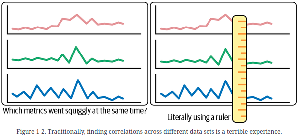

Having determined the point where the shape of the line started to look “off,” the operator would then squint and try to find other lines on the dashboard that went “squiggly” at the same time. However, because these metrics are completely independent of each other, the operator must do the comparison in their brain, without help from the computer.

Needless to say, staring at charts in hope of finding a useful correlation takes time and brainpower, not to mention it leads to eyestrain. The real work of identifying correlations must still occur in the operator’s head, again with no help from the computer.

Having gained an initial, rough guess about the problem, the operator usually begins to investigate transactions (logs) and resources (machines, processes, configuration files) they believe may be associated with the problem

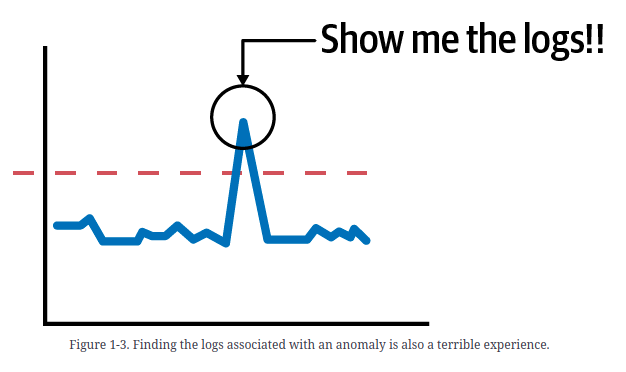

Here, again, the computer is no real help. The logs are stored in a completely separate system and cannot be automatically associated with any metrics dashboard.

Therefore, the operator is once again left to do the job of finding correlations, this time between metrics and the relevant logs.

When a (possibly, hopefully) relevant log is found, the next step is usually to determine the chain of events that caused this log to be generated. This means finding the rest of the logs in the same transaction.

Even though this is by far the most common logging workflow that operators perform, they are left to perform an ad hoc series of queries and filters to winnow down the available logs into a subset that, hopefully, represents an approximation of the transaction. To even have a chance of success, they must lean on application developers to add various request IDs and other breadcrumbs to find later and stitch together.

In a small system, this process of reconstructing transactions is tedious but possible. But once a system grows to include many horizontally scaled services, the amount of time it takes to reconstruct a single transaction begins to seriously limit the scope of any investigation.

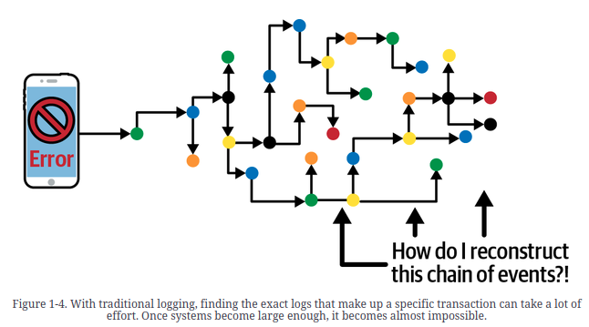

### Not Three Pillars, but a Single Braid

The above workflow really does represent a terrible state of affairs. But because we’ve been living with this technology regime for so long, we often don’t recognize how inefficient it actually is, compared to what it could be.

Today, to understand how their systems are changing, operators must first gather large amounts of data. Then they must use their minds to identify correlations in that data, based on visual stimuli such as dashboard displays and log scanning. This is an intense mental effort. It also would be unnecessary, if a computer program could scan and correlate this data automatically. Operators would save time—often in situations where time is critical—if they could focus on investigating how their system is changing, without first having to identify what is changing.

Before writing a computer program that could accurately perform this kind of change analysis, all of these data points would need to be connected. Logs would need to be linked together so that the transactions could be identified. Metrics would need to be linked to logs so that the statistics being generated could be connected to the transactions they are measuring. And each data point would need to be linked to the underlying system resources—software, infrastructure, and configuration details—so that all events could be connected to a topology of the entire system.

The end result—a single, traversable graph containing all of the data needed to describe the state of a distributed system—is the type of data structure that would give an analysis tool a complete view of the system. Rather than “three pillars” of disconnected data, we would have a single braid of interconnected data.

OpenTelemetry is a new telemetry system that generates traces, logs, and metrics in an integrated fashion.

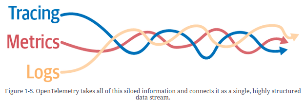

## Chapter 2. The Value of Structured Data

Squinting at graphs is not the best way to hunt for correlations. A huge amount of work currently done inside the heads of operators can actually be automated. This frees operators to move quickly among identifying issues, making hypotheses, and validating root causes.

Telemetry must have two qualities to support high-quality automated analysis:

- All data points must be connected in a graph with proper indexing.
- All data points that represent common operations must have well-defined keys and values.

### Attributes: Defining Keys and Values

The most fundamental data structure is an attribute, which is defined as a key and a value. Every data structure in OpenTelemetry contains a list of attributes. Every component of a distributed system (an HTTP request, a SQL client, a serverless function, a Kubernetes Pod) is defined in the OpenTelemetry specification as a specific set of attributes. These definitions are called the OpenTelemetry semantic conventions.

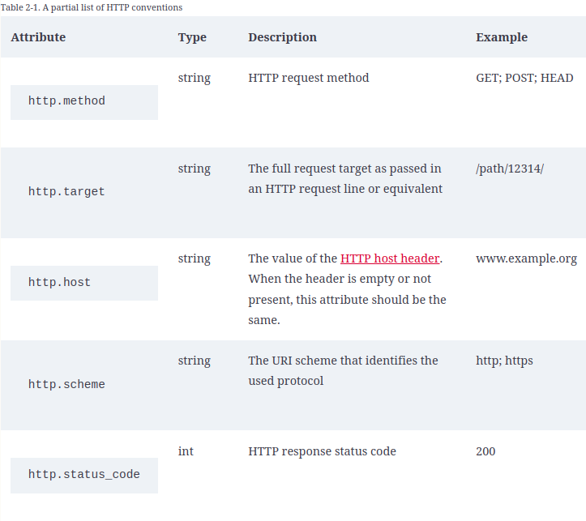

### Events: The Basis for Everything

The most basic object in OpenTelemetry is an event. An event is simply a timestamp and a set of attributes. Using a set of attributes instead of a simple message/blog allows analysis tools to index events properly and make them searchable.

Some attributes will be unique to the event. Timestamps, messages, and exception details are all examples of attributes that are specific to a particular event.

However, most attributes are not unique to an individual event. Instead, they are common to a set of events. For example, the `http.target` attribute is relevant to every event recorded as part of an HTTP request. It would be inefficient to record these attributes over and over again on every event. Instead, we pull these attributes out into envelopes that surround the events, where they can be written once. Let’s call these envelopes _context_.

There are two types of context: static and dynamic. _Static context_ defines the physical location where an event is taking place. In OpenTelemetry, these static attributes are called _resources_. Once the program starts, the values of these resource attributes usually do not change. _Dynamic context_ defines the active operation in which the event is taking part. This operation-level context is called a _span_. Every time the operation executes, the values of these attributes change.

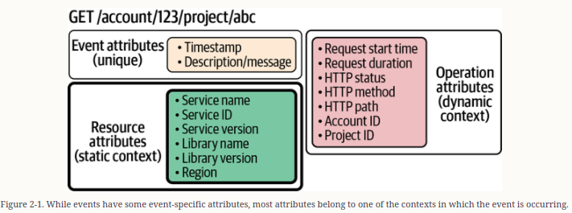

### Resources: Observing Services and Machines

Resources (static context) describe the physical and virtual infrastructure that a program is consuming. Services, containers, deployments, and regions are all resources.

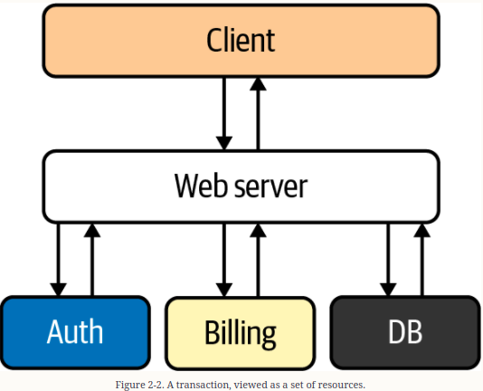

Most problems in a running system stem from resource contention, many concurrent transactions attempting to make use of the same resources at the same time. By placing events within the context of the resources they are using, it becomes possible to automatically detect many types of resource contention.

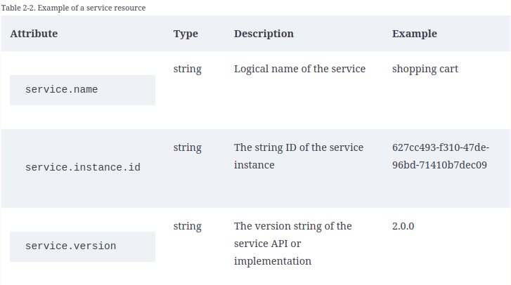

### Spans: Observing Transactions

Spans (dynamic context) describe computer operations. A span has an operation name, a start time, a duration, and a set of attributes.

Spans are also how we describe causality. To correctly record an entire transaction, we need to know which operations were triggered by which other operations. To do that, we need to add three more attributes to our spans: a TraceID, a SpanID, and a ParentID.

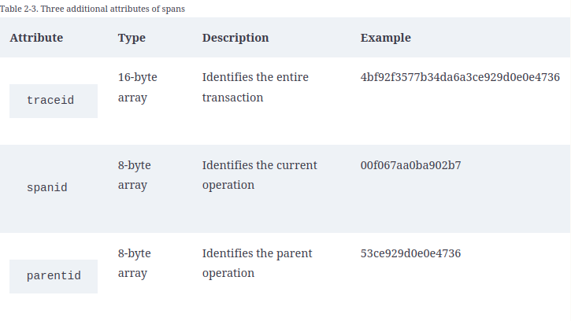

These three attributes are fundamental to OpenTelemetry. By adding these attributes, all of our events can now be organized into a graph, representing their causal relationship.

### Tracing: Like Logging, Only Better

We’ve now gone from simple events to events organized into a graph of operations associated with resources. This type of graph is called a trace. Figure 2-3 shows a common way for traces to be visualized, with a focus on identifying latency in operations.

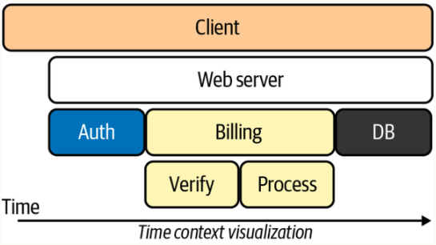

Essentially, tracing is just logging with better indexes. When you add the proper context to properly structured logs, you get traces almost by definition.

Think about how much time and effort you put into gathering those logs through searching and filtering; that is time spent gathering data, not time spent analyzing data. And the more logs you have to paw through—an ever-growing pile of machines executing an ever-increasing number of concurrent transactions—the harder it is to gather up that tiny sliver of logs that are actually relevant.

However, if you have a TraceID, gathering those logs is just one single lookup. Indexing by TraceID allows your storage tool to do this work for you automatically; you find one log and you have all the logs in the transaction right there, with no extra work.

Therefore, distributed tracing isn’t just a tool for measuring latency; it’s a data structure for defining context and causality. It’s the glue that holds everything together.

### Metrics: Observing Events in Aggregate

Now that we’ve established what events are, let’s talk about events in aggregate. In an active system, the same events occur over and over, and we look at their attributes in aggregate to find patterns. The value of an attribute could occur too often, or not often enough, in which case we want to count how often these values are occurring. Or the value may exceed a certain threshold, in which case we want to gauge how the value is changing over time. Or we may want to look at the spread of values as a histogram.

These aggregate events are called metrics. And just like regular events, metrics have a set of attributes and a set of semantic conventions to describe common concepts. Table 2-4 shows some example attributes of system memory.

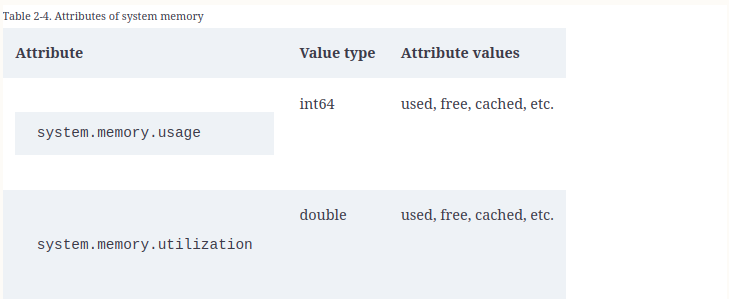

### Metrics Connected to Events: A Single Unified System

Traditionally, we think of metrics as being completely separate from logs. But they are intimately connected. For example, let’s say that an API has a metric that measures the number of errors per minute. That’s a statistic. However, each error was created by a specific transaction, using specific resources. Those specifics are present every time we increment that counter, and we want to know those specifics.

In OpenTelemetry, when metric events occur within the context of a span, a sample of these traces is automatically associated with the metric as trace exemplars. This means that there’s no guessing or hunting for logs. OpenTelemetry definitively links traces and metrics together.

### Automated Analysis and the Single Braid

Events, resources, spans, metrics, and traces: these are all connected in a single graph by OpenTelemetry, and they are all sent to the same database to be analyzed as a whole. This is the next generation of observability tools.

The transition to observing our systems holistically will have many benefits. But I believe that the primary time-saving features these new tools provide will be various forms of automated correlation detection.

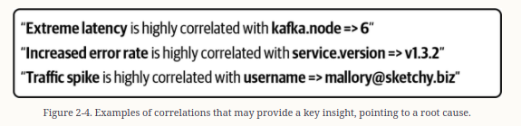

Correlations may occur in many places: between attributes in a span, between spans in a trace, between traces and resources, within metrics, as well as in all those places together.

This is why a single braid of data is so critical. The value of any automated analysis hinges entirely on the structure and quality of the data being analyzed. Machines traverse graphs of data; they don’t make leaps of logic. Accurate statistical analysis requires a telemetry system that is intentionally designed to support it.

### The Point: Automated Analysis Saves You Time

Why do we care about automating correlation analysis? Because time and complexity are against us. As systems grow in size, they eventually become too complex for any operator to hold entirely in their head, and there is never enough time to investigate every possible connection when building a hypothesis.

The problem is that choosing what to investigate requires intuition, and intuition often requires a deep knowledge of each component that makes up a distributed system. As organizations grow their systems and scale their engineering workforce accordingly, the portion of each system that any individual engineer deeply understands naturally shrinks to a smaller percentage of the entire system. Intuition doesn’t scale very well.

## Chapter 3. The Limitations of Automated Analysis

Automation is beginning to sound amazing, but here’s an important reality check: at the end of the day, computer analysis will not be able to tell you what is wrong with your system or fix it for you. It can only save you time.

With that in mind, I want to stop with the praise for a moment and acknowledge some limitations of automation. I do this because there will be quite a lot of hype around combining artificial intelligence and observability.

### Beware of Hype

To derail this hype train, I want to be clear that these kinds of dreamy marketing claims are not what I am claiming modern observability will provide. In fact, I predict that many claims related to intelligent AI problem-solving will mostly be a lot of snake oil.

Why won’t AI solve our problems? In general, machines cannot identify “problems” in software because defining what counts as a “problem” requires a form of subjective analysis.

When you have the right data structures, correlations are a kind of objective analysis—you just have to crunch the numbers. Which of those correlations are relevant and indicate the source of a real problem will always require subjective analysis, an interpretation of the data.

When investigating a system, two types of analysis come into play:

- Objective analysis, which is fact based, measurable, and observable
- Subjective analysis, which is based on interpretations, points of view, and judgment

This dichotomy—objective versus subjective—relates to an important problem in computability theory called the halting problem.

Here’s why we can identify correlations but not causation: imagine a machine that could determine what constitutes problematic behavior in any arbitrary computer program and identify the root cause of that behavior. If we actually built such a machine, it would be time to break out the champagne, because it would mean that we have finally solved the halting problem! However, there is no sign that machine learning has moved beyond Alan Turing’s model of universal computing; you can trust that this won’t be happening.

Making the right call and shipping the fix is still on you.

### Time Is Our Most Precious Resource

Identifying correlations while fetching relevant information so that you can browse through it effectively is something that computers can absolutely do for you! And that will save you time. A lot of time.

Experiencing a massive reduction in wasted time is at the heart of what it means to practice modern observability.

## Chapter 4. Supporting Open Source and Native Instrumentation

Most software systems are built with off-the-shelf parts: web frameworks, databases, HTTP clients, proxies, programming languages. Most commonly, these shared components come in the form of open source (OSS) libraries with permissive licenses.

Since these OSS libraries encapsulate almost all of the critical functionality present in an average system, access to high-quality instrumentation for these libraries is critical to most observability systems.

Traditionally, instrumentation is “sold separately.” This means that software libraries do not include instrumentation to produce traces, logs, or metrics.

In this chapter, the term solution-specific instrumentation refers to any instrumentation designed to work with a specific observability system, using a client developed as an outgrowth of that particular system’s data storage system.

Solution-specific instrumentation is a holdover from the vertical integration inherent to the “three pillars.”

### Observability Is Drowning in Solution-Specific Instrumentation

From the perspective of an observability system, instrumentation represents an immense amount of overhead.

In the past, internet applications were fairly homogenous, and it was possible to center an observability system around a particular web framework: Java Spring, Ruby on Rails, or .NET. But over time, the diversity of software has exploded. Maintaining instrumentation for every popular web framework and database client now represents an immense investment.

### Applications Are Locked In by Solution-Specific Instrumentation

Observability is a cross-cutting concern. To thoroughly trace, log, or metricize a large application means that thousands of instrumentation API calls will be spread throughout the codebase. Changing observability systems requires ripping out all of this instrumentation and replacing it with different instrumentation provided by the new system.

To support this request, many observability systems attempt to work with instrumentation provided by several other systems. But this patchwork approach degrades the quality of the data each system is ingesting.

### Solution-Specific Instrumentation for OSS Is Basically Impossible

Telemetry from OSS libraries is critical to operating the software applications built on top of them. The people with the greatest understanding of what data is critical to operations—and how operators should leverage this data to remediate problems—are the OSS library developers who actually wrote the software.

### How Do You Pick a Logging Library?

There are plenty of decent logging libraries. There are so many, in fact, that no matter which library you pick, you are guaranteed to have many users who wish you had picked a different one. What if your web framework picks one logging library and the database client library picks a different one? What if neither is the one the user wants to use? What if they choose incompatible versions of the same library?

While logs are simple enough that a hodgepodge of different solutions might be workable, that is not the case for solution-specific metrics and tracing.

As a result, OSS libraries do not usually ship with logging, metrics, or tracing built in. Instead, libraries settle on providing “observability hooks,” which require their users to write and maintain a pile of adapters to connect the libraries they use up to their observability system.

While library authors often write extensive test suites, they rarely spend much time thinking about runtime observability.

### Decomposing the Problem

We can solve all of the issues listed above by designing an observability system to explicitly address the needs of everyone involved.

#### Requirement: Separate Instrumentation, Telemetry, and Analysis

Ultimately, computer systems are actually human systems. A cross-cutting concern such as observability interacts with almost every single software component. At the same time, transmitting and processing telemetry can be such a high-volume activity that a large-scale observability system generates its own operational concerns. Providing agency is a fundamental design requirement for an effective observability system.

- _Library authors communicate what their software is doing._

For software libraries that encapsulate critical functionality, such as network and request management, library authors also must manage aspects of the tracing system: injection, extraction, and context propagation.

- _Application owners compose software and manage dependencies._

Application owners choose the components that comprise their application and ensure that they compile into a coherent, functional system. Application owners also write application-level instrumentation, which must interact cleanly with the instrumentation (and context propagation) provided by the library authors.

- _Operators manage the production and transmission of telemetry._

Operators manage the transmission of observability data from applications to responders. They must be able to choose what format the data is in and where it is being sent. While the data is in flight, they must operate the transmission system: managing all of the resources required to buffer, process, and route the data.

- _Responders consume telemetry and generate useful insights._

To do that, responders must understand both the structure and the meaning inherent to the data. (Structure and meaning are described in detail in Chapter 3.) Responders also need to add new and improved analysis tools to their toolbox when they become available.

These roles represent different decision points:

- Library authors can only make changes by releasing a new version of their code.

- Application owners can only make changes by deploying a new version of their executable.

- Operators can only make changes by managing the topology and configuration of executables.

- Responders can only make changes based on the data they are receiving.

The traditional three pillars approach scrambles all of these roles. A side effect of vertical integration is that almost any data change requires a code change. Almost any non-trivial change to the observability system requires application owners to make code changes. Requiring that other people make the changes you care about creates barriers to change and can lead to stress, conflict, and inaction.

#### Requirement: Zero Dependencies

Applications are composed of dependencies (web frameworks, database clients), plus their dependencies’ dependencies (OpenTelemetry or other instrumentation libraries), plus their dependencies’ dependencies’ dependencies (whatever those instrumentation libraries depend on).

For modern observability to work, libraries must be able to embed instrumentation without fear that it will lead to problems when their library is composed into an application. Therefore, an observability system must provide instrumentation that does not contain dependencies that may inadvertently trigger a transitive dependency conflict.

#### Requirement: Strict Backward Compatibility and Long-Term Support

A well-instrumented application may end up with many thousands of instrumentation call sites. Having to update thousands of call sites due to an API change is a significant amount of work.

Therefore, instrumentation APIs must be strictly backward compatible, over a very long time scale. Ideally, instrumentation APIs never break backward compatibility—ever—once they have become stable. And new, experimental API features must be developed in such a way that their existence does not create conflicts between libraries that contain stable instrumentation.

### Separation of Concerns Is Fundamental to Good Design

If you analyze these requirements, you may notice something peculiar: there is almost nothing about them that is specific to observability. Instead, the focus is on minimizing dependencies, maintaining backward compatibility, and ensuring that different users can perform their roles without needless interference.

Each requirement points to a separation of concerns as a key design feature. But these features are not unique to OpenTelemetry. Any software library that seeks wide adoption would do well to include them.
