# A Beginner's Guide to eBPF by Liz Rice

Today. I'm going to talk about why I'm so excited about it, why I think it's really revolutionising what we can do in terms of tooling for not just networking but also observability and Security in the cloud native space.

I'm going to show you some code because I would think that helps to make things a bit more concrete and I I am also going to just talk a little bit more broadly about the kind of tools that we can build based on eBPF.

## What is eBPF 

So what is ebpf stands for extended Berkeley packet filter, which Tells you something about the history of this technology, but it's not terribly useful for understanding, what it really is. 

What it really is, is a way of making the kernel programmable. It lets us run custom programs inside the kernel. 

Brendan Greg, who's a real Pioneer. In this space has a couple of really useful quotes.

`Superpowers have finally come to Linux`

And I hope that, by the end of this presentation, you'll see what he means. 

And, and I believe this to the other quote here about eBPF. 

`eBPF does to Linux what JavaScript does to HTML`

Terms of allowing us to make it programmable. Change the way that the kernel behaves.

### Run custom code in the kernel

So how do we actually do this? Most of us if we're writing applications, right in user space and every time we want to do anything that interacts with Hardware in any way, writing to a file, displaying something on the screen, talking over a network, anything at all. 
Pretty much requires, assistance from the kernel and the kernel is a sort of privileged part of the operating system, most of the time. If we're developers or operators, we don't really need to care.
Very much about what's happening inside the kernel, we normally deal with what's happening in user space. With eBPF, though. We can start running custom code inside the kernel. We have eBPF programs. 
We load them into the kernel and we attach them to events. Now if we're in a user-space and the program is in the kernel, then there has to be something called a system call between those two things and the system called that relates to eBPF is called BPF. 

### Man BPF
The bpf() system call performs a **range of operations** related to extended Berkeley Packet Filters. Extended BPF (or eBPF) is similar to the original ("classic") BPF (cBPF) used to filter network packets.

For both cBPF and eBPF programs, the kernel statically analyzes the **programs** before loading them, in order to ensure that they **cannot harm the running system**.

eBPF extends cBPF in multiple ways, including the ability to call a fixed set of **in-kernel helper functions** and access shared data **structures such as eBPF maps**.

eBPF programs can be written in a **restricted C** that is compiled (using the clang compiler) into **eBPF bytecode**. Various features are omitted from this restricted C, such as loops, global variables, variadic functions, floating-point numbers, and passing structures as function arguments. 

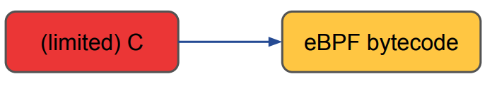

The kernel contains a just-in-time (JIT) compiler that **translates eBPF bytecode into native machine code** for better performance.


#### Clang & LLVM

“The LLVM Project is a collection of modular and reusable compiler and toolchain technologies. Despite its name, LLVM has little to do with traditional virtual machines. The name "LLVM" itself is not an acronym; it is the full name of the project.”

“Clang is an ‘LLVM native’ C/C++/Objective-C compiler, which aims to deliver amazingly fast compiles”

### BCC

“BCC makes BPF programs easier to write, with kernel instrumentation in C (and includes a C wrapper around LLVM), and front-ends in Python and lua.” 

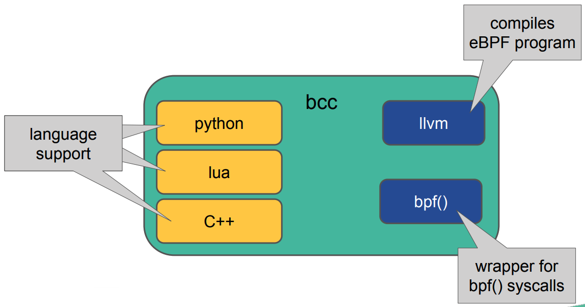

### eBPF Hello World

```bash
#!/usr/bin/python
from bcc import BPF
prog = """
int my_prog(void *ctx) {
 bpf_trace_printk("Hello world\\n");
 return 0;
}
"""
b = BPF(text=prog)
b.attach_kprobe(event="sys_clone", fn_name="my_prog")
b.trace_print()
```

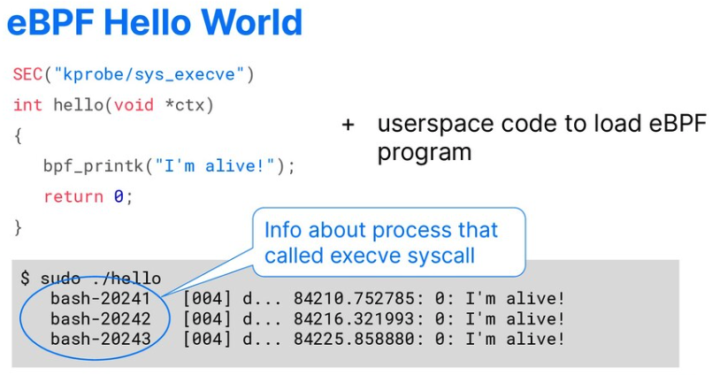

### Triggering eBPF programs

We can trigger eBPF programs for from all sorts of different events. 

Any function that you're running in any application, we can attach eBPF program to, we can also attach to the return from any function in both the kernel. 

We can attach to trace points with can attach the network packets. We can attach to perform events for observability. We can pretty much attach our BPF programs to any kind of event. 

eBPF programs can be attached to different events.

- Kprobes
- Uprobes
- Tracepoints
- Network packets
- Perf events
- etc...

### BCC function names

You might have many many different ebpf programs running and if they were all writing to the Trace that that quickly becomes hard to hard to manage and hard to read. So instead we want to pass data between user space and kernel using what's called an eBPF map. 

```bash
b = BPF(text="""
int kprobe__sys_clone(void *ctx) {
    bpf_trace_printk("Hello, DockerCon!\\n");
    return 0;
}
""")
b.trace_print()
````

Writing to

`/sys/kernel/debug/tracing/trace_pipe`

## eBPF maps

So there are lots of different types of eBPF map. They're all key value stores and they allow us to write data in the kernel and read it out from user space or vice versa. 

```
BPF_MAP_TYPE_UNSPEC
BPF_MAP_TYPE_HASH
BPF_MAP_TYPE_ARRAY
BPF_MAP_TYPE_PROG_ARRAY
BPF_MAP_TYPE_PERF_EVENT_ARRAY
BPF_MAP_TYPE_PERCPU_HASH
BPF_MAP_TYPE_PERCPU_ARRAY
BPF_MAP_TYPE_STACK_TRACE
BPF_MAP_TYPE_CGROUP_ARRAY
BPF_MAP_TYPE_LRU_HASH
BPF_MAP_TYPE_LRU_PERCPU_HASH
BPF_MAP_TYPE_LPM_TRIE
BPF_MAP_TYPE_ARRAY_OF_MAPS
BPF_MAP_TYPE_HASH_OF_MAPS
BPF_MAP_TYPE_DEVMAP
BPF_MAP_TYPE_SOCKMAP
BPF_MAP_TYPE_CPUMAP
```

## eBPF object file includes code and maps

So when we compile a BPF program, we actually get not just the object file for the bytecode, the program itself. We also get a definition of the maps that we want to load into the kernel. 

So there's an object file that we get out of the compiler user space uses BPF system call to both load the program into Kernel and load the maps or create the maps inside the kernel. 

The program gets passed through a verification step. And this is really important in terms of making sure that the BPF code is safe to run. As I mentioned before, it must not crash. If it crashes, it brings down your machine because it's in the kernel. 

So in order to ensure that it's safe to run, the verifier will check certain restrictions on the code and we'll talk in a moment about what those restrictions are. So the program gets loaded, the maps are created in the kernel. 

Then use a space needs to tell the kernel what events are going to trigger this kernel. You saw me attached to The entry point to a system call, and then if we have Maps involved, we can use some other operations in that BPF, system call to read and write information into any Maps. 

`clang -O2 -emit-llvm -c bpf.c -o - | llc -march=bpf -filetype=obj -o bpf.o`

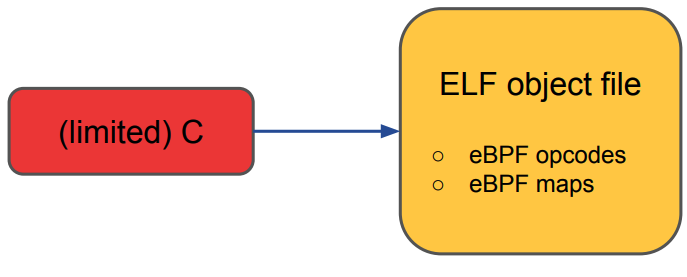

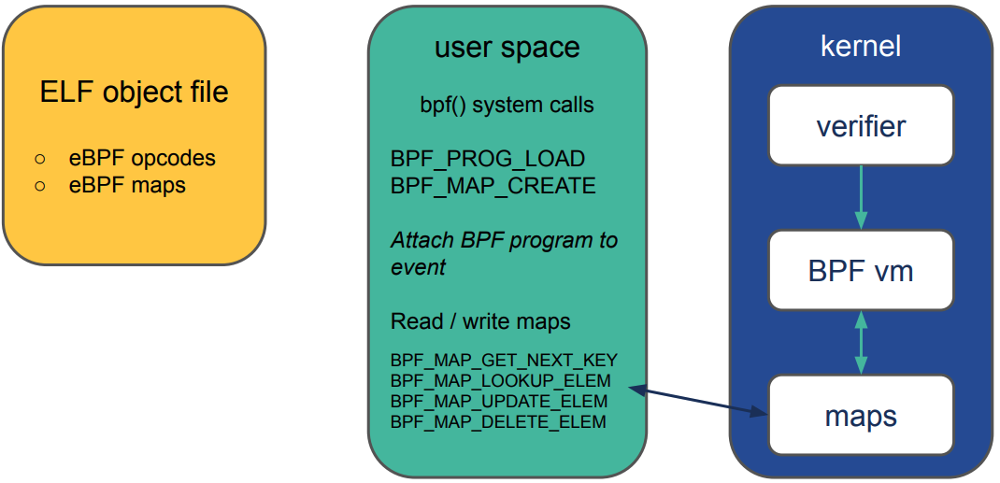

## Maps using

```bash
#!/usr/bin/python
from bcc import BPF
from time import sleep

program = """
    BPF_HASH(packets);
    int hello(struct xdp_md *ctx) {
        u64 key = 0;
        u64 counter = 0;
        u64 *p;
        
        p = packets.lookup(&key);
        if (p != 0) {
            counter = *p;
        }

        counter++;
        packets.update(&key, &counter);

        return 0;
    }
"""
b = BPF(text=program)
b.attach_xdp(dev="eth0", fn=b.load_func("hello", BPF.XDP))

while True:
    sleep(1)
    for k,v in b["packets"].items():
        print("key {}, counter {}\n".format(k.value, v.value))
```

### eBPF helper functions

Use it for tracing. We can also get information about the context of the event. We might be able to get things like the current time or the process ID information that might be useful to pass. For observability or security purposes from the ebpf program. 

### Verifier

Each eBPF program is a set of instructions that is safe to run until its completion. An in-kernel verifier statically determines that the eBPF program terminates and is safe to execute.

- No loops
- No bad pointer dereferences
- Restricted program size
- Always exits

## Programmable kernel in kubernetes deployments

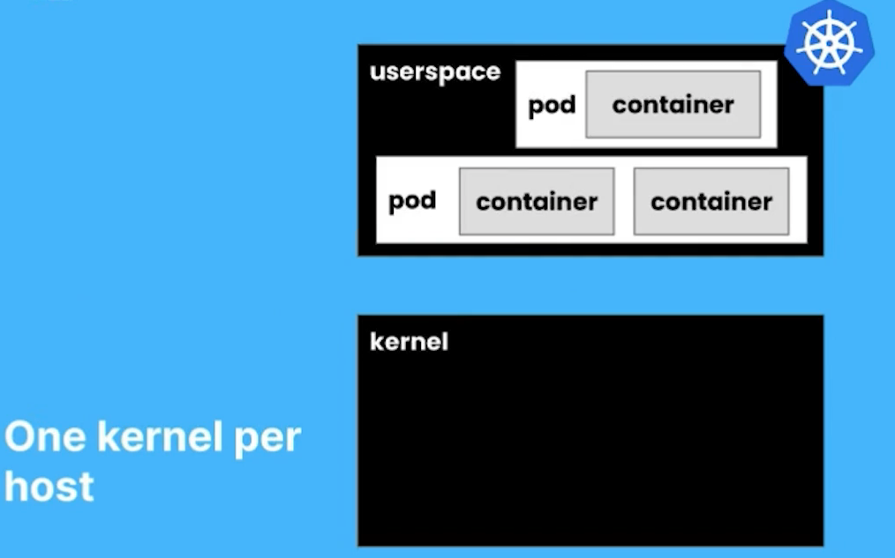

What is this mean for kubernetes deployment in the world of cloud native? And what does it mean for tooling that can take advantage of eBPF? 

Well, in kubernetes, we're running our code, our application code in containers and those containers are running or grouped inside pods, but all of the pods on any given host. Whether they're running on bare metal, or on a virtual machine, they all share one kernel. 

So whenever your application code running in containers wants to do anything, like, send and receive Network packets or access files or whenever kubernetes wants to create new containers. 

Anything kind of interesting is going to require assistance from the kernel and that means the kernel knows about That's happening on that machine. 

And that means that if we instrument the kernel with eBPF programs, we can be aware of things that are happening in any pod and we can do that without needing to change the applications. We don't even need to reconfigure them. We immediately have visibility and potentially control using eBPF. 

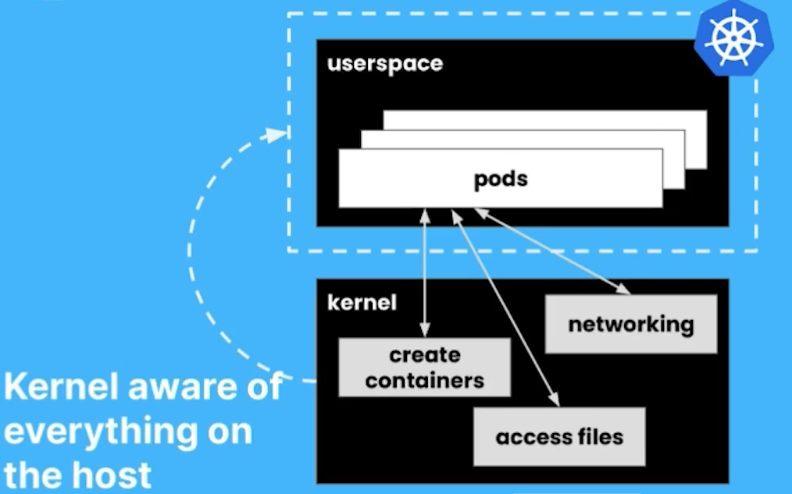

This is a really nice contrast to the sidecar model that typically gets used for instrumenting, whether we're talking about observability or security tooling a lot of it and service mashes. 

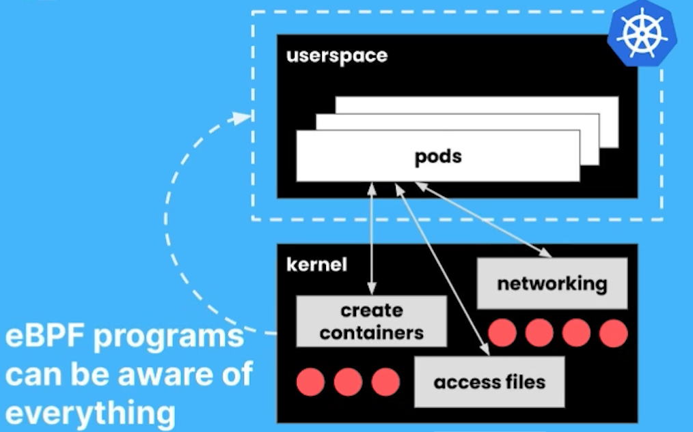 

## a sidecar has a view across one pod

Well, a sidecar model has every pod instrumented, using an extra sidecar container. So when you want your pod to be instrumented whether this is fair observability for logging for tracing for service mesh for security that tool has to be injected as a sidecar into each pod, so that the sidecar has visibility over what's happening. 

In that pod and the sitecar gets there by being defined as yeah. Yaml. And something has to create that yaml. You probably aren't doing it. Manually. It's probably happening as part of maybe CI, CD, or an admission control. Webhook. 

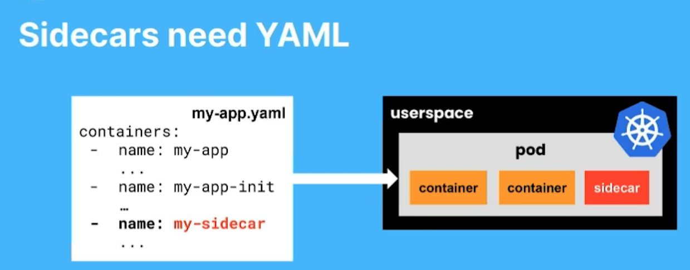

Something is configuring that yaml and what if it goes wrong or what if you don't label your app such that it does get this. 

Yeah, yaml added correctly. If there's no yaml, there's no sidecar and your application just doesn't get instrumented. 

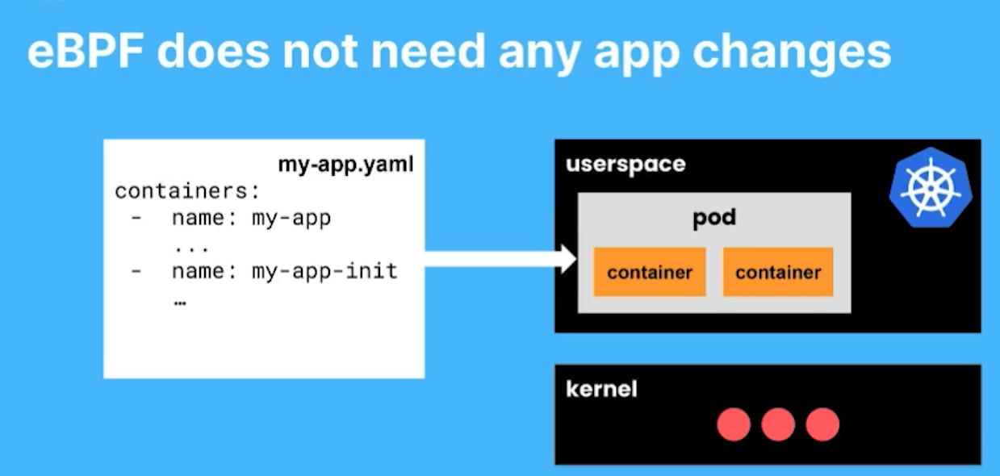

In contrast with eBPF where because we can add the instrumentation directly into the kernel. The pod doesn't need any changes at all to be observable to be subject to whatever the eBPF code can do. 

That also means, not only do you not have to modify any configuration for your apps? If you are in a situation where your Node gets compromised in any way or the attacker. 

Probably won't insert instrumentation for you. But any process running on that host is subject to the same. It's just as visible to eBPF as a legitimate program. So it makes malicious activity is just as as as visible to eBPF as expected activity. 

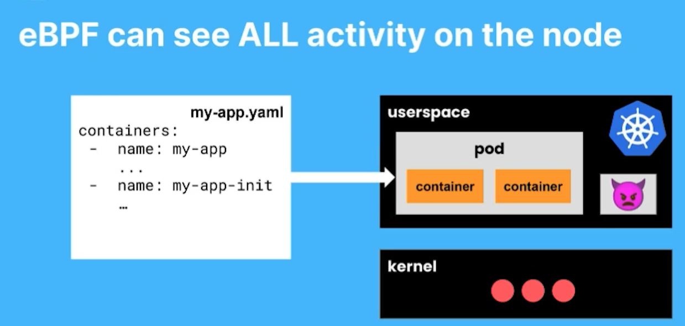

## Efficient container networking

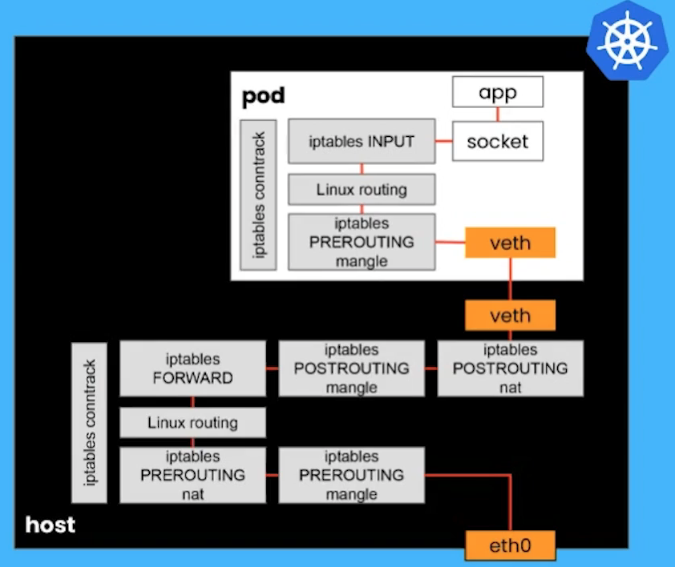

BPF also gives us really efficient container networking. So in a normal traditional environment without BPF, there's a network namespace for every pod. And that means it has its own networking stack.

There's also a networking stack on the host. So when a packet arrives at the interface to the host, if it's destined for the Pod, it has to Traverse all the way through the host. Networking stack to reach the virtual, ethernet connection, to the Pod and then Traverse another networking stack. 

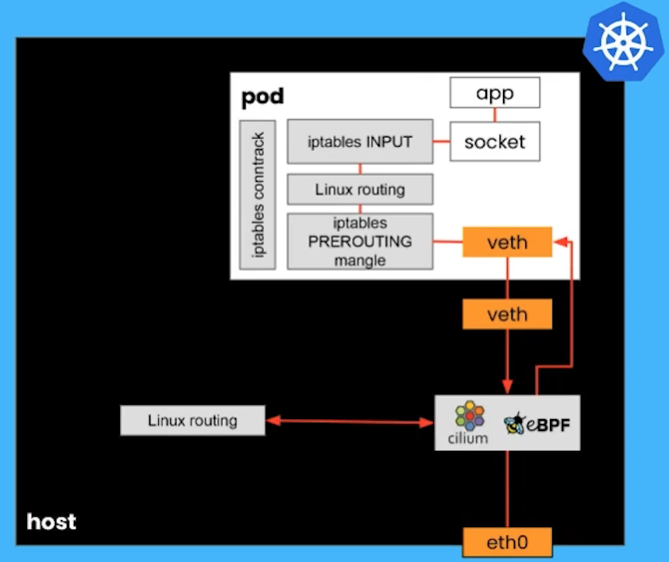

With eBPF particularly with a CNI that's based on eBPF like Cilium. Well Cilium has set up the endpoints. It knows what pods are on this host. It knows about the addressing for the pods. So when that packet arrives at the hosts network interface, cilium can pick that pack it up, and send it directly to the Pod where its intended to arrive, and bypass that whole networking stack on the host. And that leads to real.

## eBPF-accelerated service mesh

This to next step for this evolution is using eBPF as the data plane for service mesh. So in a sidecar enabled, service mesh in a traditional networking environment, not only does the packet have to go through the hosts networking stack. 

When it gets to the Pod. It has to Traverse through the kernel to use a space to get to the Proxy. And then back through the kernel again to get to the application container with a BPF, we can do the same kind of shortcutting that I showed you for just normal container networking. 

And again, this is going to make a substantial Improvement to latency, which is one of the concerns that's often cited about service mesh because we can just be much more efficient about getting those Network packet. Through the proxy and to the application. 

So that's really a kind of lightning tour around some of the reasons why I think that the new generation of tooling that's based on ebpf is so much more effective so much easier to deploy really efficient. We didn't really even touch on some of the security observability that we're able to achieve. 

With eBPF again because BPF can have visibility into everything that happens. Making Intelligent Decisions about what's malicious, is a real superpower from eBPF tooling. I hope that's given you some idea why I'm so excited about this space and this technology eBPF. Is a great site if you want to dig into the details, And you can always find me online. 

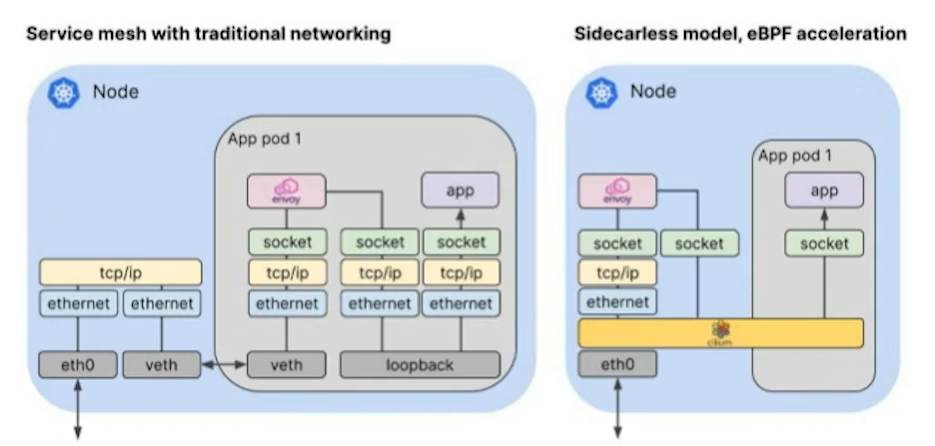

## Questions

### Question 1

Sam: You know safeguarding is crashes of your eBPF program is fine to the, make sure that you can't bring the kernel down, but are there security risks in allowing custom code to be run in kernel? 

Liz: I think the key thing is to think about the, the set of people who should be allowed to manipulate eBPF tooling. They're the same people who should be allowed to install a new kernel, you know, that that is a seriously privileged operation. 

Now, there is a thing called unprivileged eBPF and cutting a long story short. I think the Now, is that unprivileged eBPF was pretty much a mistake and should be turned off. Not all distros today. Have unprivileged eBPF disabled. So I would recommend turning that Knob Off on your kernel. Even if you're not using BPF, it's a bad idea to allow unprivileged eBPF. 

### Question 2

Sam: Who do you see as being the prime audience for building things on top of eBPF? Is it something that you think developers are going to do? Is it something serious happens going to do? Or is it really going to be the purview of people building the tools and technologies that developers of operators people might use?

Liz: Yeah, it does, rapidly get pretty complex. And when you're working in the kernel, you're dealing with kernel constructs. So although I kind of encourage anybody who's interested. If they want to play with BPF programming. Don't be scared to give it a try because I think experimenting with things is fun. But for real production level tooling, you know, you probably not going To roll it yourself. 

You're probably going to be using tools that other people are working on. I mean, obviously, silly and being one of those, but I'd also mention Falco and pixie that are other eBPF based tools in the CNCF world. Yeah. It's this also, you know, when you start getting into this space you get to fight with the verifier about what's allowed and what isn't allowed. So it's a whole, there's a whole can of worms.
